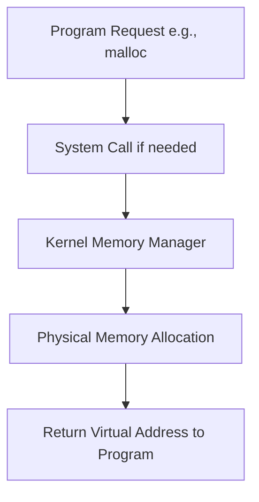
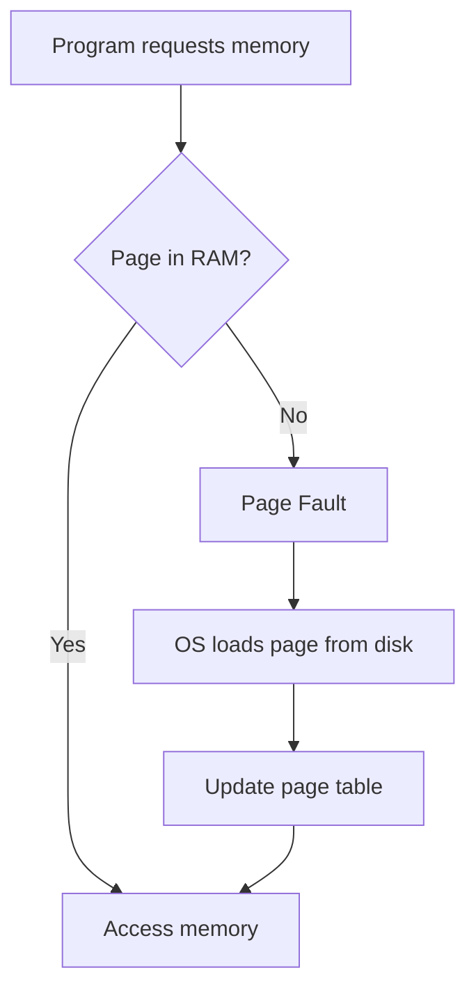

# Introduction to Memory Management: A Comprehensive Overview

## 1. The Fundamental Reality of Memory in Computing

> All programs require memory to run. This is an inescapable truth in computing.

Data must be stored somewhere within the computer's memory system, regardless of:
- Programming language
- Application complexity
- System architecture

## 2. The Modern Computing Landscape

Today's computing environments are characterized by multitasking capabilities:

🖥️ A typical user might simultaneously:
- Run a resource-intensive video game
- Stream music from an online service
- Browse multiple websites
- Operate productivity software

This concurrent execution demonstrates the sophisticated memory management of modern operating systems.

## 3. Program and Operating System Interaction

Programs don't directly access physical memory. Instead, they interact with the OS through abstractions:

### 3.1 User Space vs. Kernel Space
- **User Space**: Programs run with limited privileges
- **Kernel Space**: OS kernel operates with full system access

### 3.2 Memory Allocation Process

## 4. The Virtual Memory Model

Virtual memory is a critical abstraction that simplifies programming and enhances system capabilities.

### 4.1 Purpose
- Provides each process with its own address space
- Allows running programs larger than physical RAM
- Enhances security through memory isolation

### 4.2 Key Components
1. **Virtual Address Space**: Typically much larger than physical RAM
2. **Page Tables**: Map virtual to physical addresses
3. **Pages and Frames**: Fixed-size units of virtual and physical memory (typically 4KB or 4MB)

### 4.3 Memory Access Process

When a program requests memory:

1. The program uses a virtual address
2. The Memory Management Unit (MMU) attempts to translate this to a physical address
3. The OS checks if the required page is in physical memory (RAM)

### 4.4 Page Faults

> A page fault occurs when the requested page is not currently in physical memory

Process:
1. Program requests data from a virtual address
2. MMU checks if the page is in RAM
3. If not found (page fault):
   - OS interrupts the program
   - Locates the page on disk
   - Loads it into an available frame in RAM
   - Updates the page table
   - Resumes program execution

### 4.5 Page Replacement

When RAM is full and a new page is needed:
1. OS selects a page to evict (using algorithms like LRU - Least Recently Used)
2. If modified, the evicted page is written back to disk
3. The new page is loaded into the freed frame

This mechanism allows running programs larger than available physical memory.

## 5. Memory Allocation in Different Operating Systems

| Operating System | Typical Allocation |
|------------------|---------------------|
| 32-bit systems   | Up to 4GB per process |
| 64-bit systems   | Much larger (e.g., 128TB on some systems) |

> Actual usable memory depends on OS design and physical resources.

## 6. Challenges in Memory Management

1. **Fragmentation**: 
   - Internal (within allocated blocks)
   - External (between allocated blocks)
2. **Performance Overhead**: 
   - Due to address translation
   - Potential disk I/O from page faults
3. **Concurrency Issues**: 
   - Managing memory access in multi-threaded environments
4. **Memory Leaks**: 
   - Failure to properly deallocate memory in long-running programs

## 7. The Programmer's Perspective

From a developer's viewpoint, memory management involves:

1. **Allocation**: Requesting memory when needed
2. **Usage**: Properly accessing and manipulating allocated memory
3. **Deallocation**: Returning memory to the system when no longer needed
4. **Optimization**: Efficiently using memory to enhance program performance and minimize page faults

## 8. Conclusion

Effective memory management is crucial for:
- System stability
- Security
- Performance

As programs become more complex and systems more powerful, understanding these concepts becomes increasingly important for developers and system designers alike.

---

**Key Takeaway**: 
> Mastering both program logic and memory management, including an understanding of virtual memory and paging, is essential for developing efficient, stable, and secure software applications.
