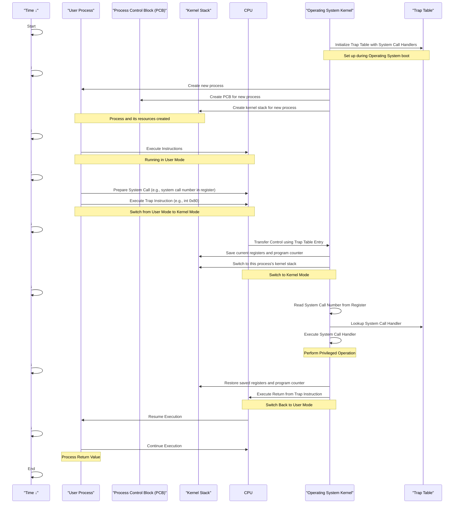

# Comprehensive Explanation of the System Call Process

## Visual Representation

## Detailed Explanation

1. **Initialization:**
   - The Operating System Kernel initializes the Trap Table with System Call Handlers.
   - This setup occurs during the Operating System boot process.
   - The trap table is a crucial data structure that maps system call numbers to their corresponding handler functions in the kernel.
   - The Operating System also creates a separate kernel stack for each process. This stack will be used when the process enters kernel mode.

2. **User Process Execution:**
   - The User Process runs in User Mode, executing normal instructions.
   - This is the standard mode of operation for user-level applications.
   - In this mode, the process has limited privileges and cannot directly access hardware or perform certain protected operations.

3. **System Call Initiation:**
   - When the User Process needs to perform a privileged operation, it prepares for a system call:
     a. It loads the specific system call number into a designated register. This number identifies which system call is being requested.
     b. Then, it executes a special trap instruction (e.g., "int 0x80" in x86 architecture).
   - This step signals to the CPU that the process requires kernel intervention.
   - The trap instruction is designed to cause an intentional exception, forcing a switch to kernel mode.

4. **Mode Switch (User Mode to Kernel Mode):**
   - The CPU switches from User Mode to Kernel Mode.
   - This is a critical security feature that prevents user processes from directly accessing privileged operations or memory areas.
   - During this switch, several important actions occur:
     a. The current user-mode stack pointer is saved.
     b. The kernel switches to using the kernel stack that was created for this process.
     c. The CPU privilege level is changed to allow execution of privileged instructions.

5. **Control Transfer (Using Trap Table):**
   - The trap instruction causes the CPU to transfer control to the Operating System Kernel using the Trap Table.
   - Here's the detailed process:
     a. The trap instruction triggers the CPU to look up a specific entry in the trap table.
     b. This entry contains the memory address of the general system call handler in the kernel.
     c. The CPU then jumps to this address, effectively transferring control to the Operating System Kernel.
   - This mechanism allows the OS to intercept the system call and handle it securely, maintaining the separation between user space and kernel space.

6. **Context Saving:**
   - The Operating System Kernel saves the current context of the process in its Kernel Stack.
   - This includes saving:
     a. All general-purpose registers
     b. The program counter (which points to the instruction right after the system call)
     c. The current process state
   - Saving this information is crucial for later restoring the process to its exact state before the system call.

7. **System Call Handling:**
   - The Operating System Kernel reads the system call number from the register where it was placed by the user process.
   - It uses this number to look up the specific system call handler in the Trap Table.
   - The appropriate handler function is then executed to perform the requested operation.

8. **Privileged Operation:**
   - The handler performs the privileged operation that the user process requested but couldn't do directly.
   - This could involve actions like:
     a. Accessing hardware devices
     b. Managing memory (e.g., allocating new memory to the process)
     c. Interacting with other processes
     d. Accessing or modifying protected system data structures

9. **Return Preparation:**
   - Once the operation is complete, the Operating System Kernel prepares to return control to the User Process.
   - This includes:
     a. Setting up any return values or error codes resulting from the system call.
     b. Restoring the saved registers and program counter from the kernel stack (per-process), ensuring that it will return to the correct point in the user process.

10. **Return from Trap:**
    - The Operating System Kernel executes a special "return from trap" instruction (e.g., `iret` in x86 architecture).
    - This instruction is crucial as it atomically performs several operations:
      a. Restores the program counter to the saved user-mode instruction (the instruction right after the system call).
      b. Switches the CPU from kernel mode back to user mode.
      c. Restores the user-mode stack pointer.
      d. Restores other saved registers.
    - The atomic nature of this instruction ensures that there's no vulnerable intermediate state during the transition back to user mode.

11. **Resumption of User Process:**
    - The User Process resumes execution at the instruction immediately following the system call.
    - It now has access to the results of the system call, typically through return values in specific registers.
    - The process continues its normal operation, using the results of the system call if necessary.

## Key Components and Their Roles

1. **Trap Table:**
   - Acts as a dispatch table for system calls.
   - Maps system call numbers to their corresponding handler functions in the kernel.
   - Ensures that user processes can only invoke predefined entry points into the kernel.

2. **Kernel Stack:**
   - A separate stack used by the kernel when handling system calls or exceptions for a process.
   - Prevents interference between kernel operations and the user process's stack.
   - Each process has its own kernel stack to maintain isolation between processes.

4. **CPU Privilege Levels:**
   - Provides hardware-level separation between user mode and kernel mode.
   - Restricts access to sensitive instructions and memory areas based on the current privilege level.

5. **Trap and Return-from-Trap Instructions:**
   - Special CPU instructions that facilitate secure transitions between user and kernel modes.
   - Ensure atomicity in mode switches, preventing exploitation of intermediate states.

The system call process, with its carefully orchestrated steps and specialized components, forms a fundamental mechanism in modern operating systems. It allows user processes to request privileged operations while maintaining strict control over the transition between user space and kernel space. This architecture is crucial for ensuring system security, stability, and the isolation of processes, all while providing necessary services to user-level applications.
