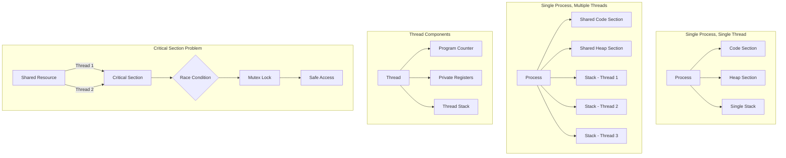
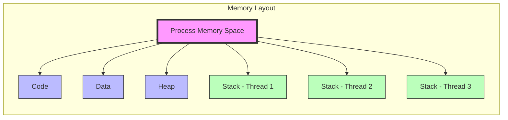
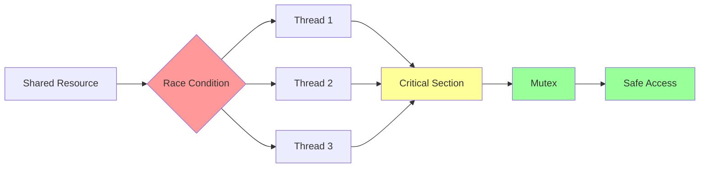
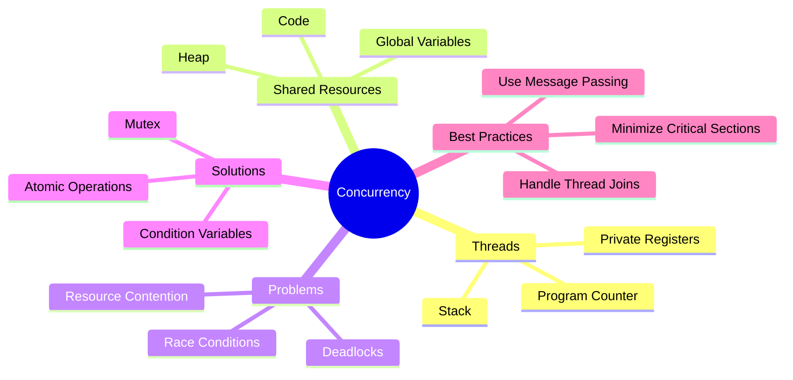

# Introduction to Concurrency



## Real-World Analogy
Imagine a scenario with 3 banknotes and 3 people:
- When people don't communicate and randomly try to pick up notes
- This can lead to conflicts (like race conditions in programming)
- This simple example perfectly illustrates concurrent programming challenges

## Understanding Threads
A thread is a fundamental unit of CPU execution that represents an independent path of execution within a process.

### Key Characteristics:
1. **Shared Resources**
   - All threads within a process share:
     - Code section
     - Heap memory
     - Global variables
   - Each thread has its own:
     - Program counter
     - Register set
     - Stack

2. **Thread vs Process**
   - Threads are "lightweight" compared to processes
   - Thread creation is faster than process creation
   - Context switching between threads is typically faster

## Process and Thread Architecture



## Why Use Threads?

### 1. Parallelism
Example: Processing 10,000 arrays
- **Single-threaded**: Process one array at a time
- **Multi-threaded**: Divide work among multiple threads
  - 10 threads → 1,000 arrays each
  - Significant performance improvement

### 2. Improved Interactivity
- Prevents blocking on I/O operations
- Better CPU utilization
- Enhanced responsiveness

## Thread Operations in Rust

### Basic Thread Creation
```rust
use std::thread;
use std::time::Duration;

fn main() {
    // Create and spawn a new thread
    let handle = thread::spawn(|| {
        // Thread work here
        for i in 1..10 {
            println!("Thread: {}", i);
            thread::sleep(Duration::from_millis(1));
        }
    });

    // Wait for thread to complete
    handle.join().unwrap();
}
```

## Concurrency Challenges



### 1. Race Conditions
- Occurs when multiple threads access shared data simultaneously
- Result is non-deterministic
- Example of a race condition:
  ```rust
  // Dangerous in concurrent context
  a = a + 1  // Can be interrupted between read and write
  ```

### 2. Critical Sections
- Portions of code that access shared resources
- Must be protected to ensure thread safety

### 3. Solutions

#### Mutex (Mutual Exclusion)
- Ensures only one thread can access protected data at a time
- Key concept: Lock and unlock mechanism
- Prevents race conditions

#### Atomic Operations
- Operations that complete in a single step
- Cannot be interrupted
- Example: Bank transactions (withdrawal + deposit)

#### Condition Variables
- Enable thread synchronization
- Allow threads to wait for specific conditions
- Used for coordinating thread execution

## Best Practices
1. Minimize critical sections
2. Use appropriate synchronization mechanisms
3. Avoid shared state when possible
4. Consider using message passing
5. Always handle thread joins properly

## Key Concepts Summary



### Final Takeaways
- Critical Sections: Regions accessing shared resources
- Race Conditions: Concurrent access leading to undefined behavior
- Deterministic vs Non-deterministic Execution
- Mutual Exclusion: Controlled access to shared resources
