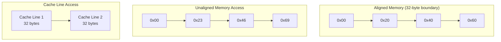

# Memory Alignment and Layout Explanation

## Memory Alignment

### What is Memory Alignment?



### Key Concepts

1. **Memory Address Divisibility**
   ```rust
   // 32-byte alignment means address must be divisible by 32
   address % 32 == 0  // True if aligned
   ```

2. **Memory Access Patterns**
```
Aligned (efficient):
0x20 [32 bytes of data] 0x40
|------ Cache Line ------|

Unaligned (inefficient):
0x23 [32 bytes of data] 0x43
|-- Cache Line 1 --||-- Cache Line 2 --|
```

## Layout in Rust

### Understanding Layout

```rust
let layout = Layout::from_size_align(size * std::mem::size_of::<f32>(), align).unwrap();
```

Layout defines two crucial properties:
1. **Size**: Total number of bytes needed
2. **Alignment**: Memory boundary requirement

### Example Layout Calculations

```rust
// For a vector of 1024 f32 values with 32-byte alignment:
size = 1024 * 4 bytes = 4096 bytes (total size)
alignment = 32 bytes
```

### Layout Requirements

1. **Size Rules**
   - Must be non-zero
   - Must be less than isize::MAX
   ```rust
   assert!(size > 0);
   assert!(size <= isize::MAX as usize);
   ```

2. **Alignment Rules**
   - Must be a power of 2
   - Must be ≤ size
   ```rust
   assert!(align.is_power_of_two());
   assert!(align <= size);
   ```

## Why Alignment Matters

### Performance Impact

1. **Single Memory Access**
```
Aligned:    [||||||||] → One memory fetch
Unaligned:  [|||]|[|||] → Two memory fetches
```

2. **Cache Efficiency**
```
Cache Line 1    Cache Line 2    Cache Line 3
[32 bytes    ]  [32 bytes    ]  [32 bytes    ]
```

### AVX Operations

```rust
// Aligned Load (faster)
_mm256_load_ps(aligned_ptr)    // Requires 32-byte alignment

// Unaligned Load (slower)
_mm256_loadu_ps(unaligned_ptr) // Works with any alignment
```

## Layout Usage in Our Code

```rust
fn create_aligned_vec(size: usize, value: f32) -> Vec<f32> {
    // 1. Create layout specification
    let align = 32; // AVX requires 32-byte alignment
    let layout = Layout::from_size_align(
        size * std::mem::size_of::<f32>(), // Total size needed
        align                              // Alignment requirement
    ).unwrap();

    unsafe {
        // 2. Allocate aligned memory
        let ptr = alloc(layout) as *mut f32;
        
        // 3. Initialize memory
        for i in 0..size {
            *ptr.add(i) = value;
        }
        
        // 4. Create Vec from raw parts
        Vec::from_raw_parts(ptr, size, size)
    }
}
```

### Benefits in Our Code

1. **Regular Addition**
   - No alignment guarantee
   - Might cross cache lines

2. **Unaligned SIMD**
   - Uses `_mm256_loadu_ps`
   - Works with any alignment
   - Potentially slower

3. **Aligned SIMD**
   - Uses `_mm256_load_ps`
   - Guaranteed 32-byte alignment
   - Optimal performance
   - Single cache line access

## Memory Access Visualization

```
Aligned 32-byte AVX Load:
Address: 0x20
[0x20]|-------------------------|[0x40]
      |<---- 32 bytes data ---->|

Unaligned 32-byte AVX Load:
Address: 0x23
[0x20]|-----|[0x23]|------------|[0x40]|------|[0x43]
      |Cache Line 1|        |Cache Line 2|
```

### Performance Implications
- Aligned: One memory transaction
- Unaligned: Two memory transactions
- Cache line splits can cause 2-3x slowdown
